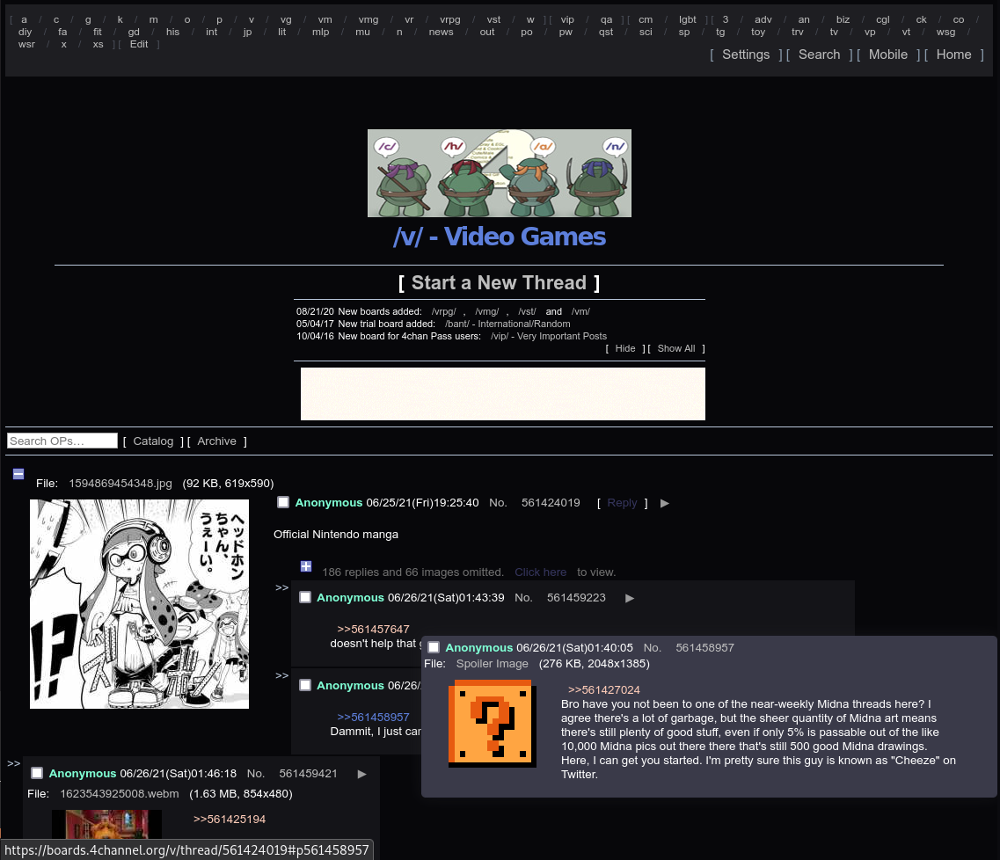
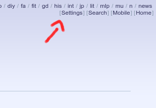
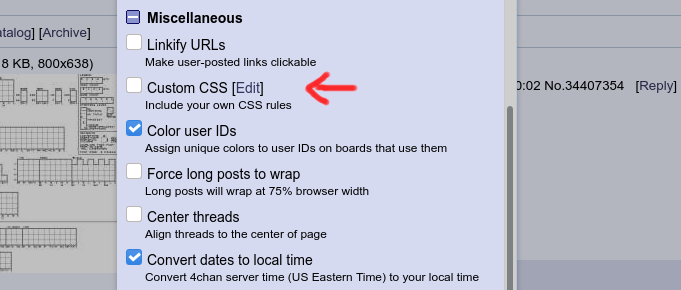
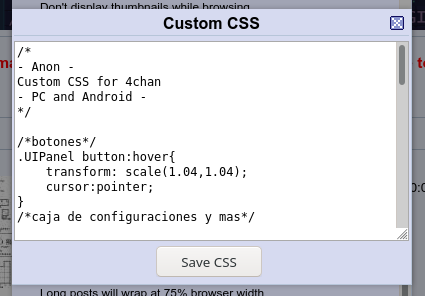
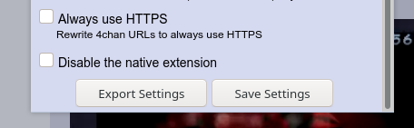

[es](README_es.md)

# Cold-Night
Tema Oscuro para la pagina 4chan

Solo para 4chan vanila, aun no funciona en 4chan X.

## Como Agregar Este tema a 4chan?

Primero Obtenga el archivo con los estilos [**aqui**](https://github.com/448L/Night/releases)

Acceda a [4chan](https://www.4chan.org/) y vaya a un tablon, arriba busque "settings".

Navege hasta encontrar el apartado de "Miscellaneous", busque la opcion "Custom CSS" y marque la casilla, luego de click sobre "edit".

Copie los Estilos o codigo del archivo "Cold_Night.css" en el cuadro, luego de click sobre "Save CSS".

Por ultimo, dirijase hacia abajo, y de click sobre "Save Settings"

