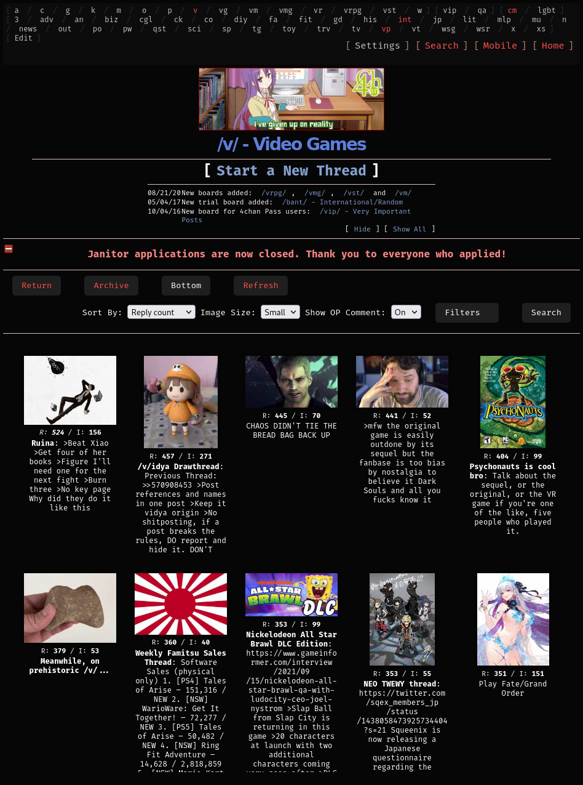
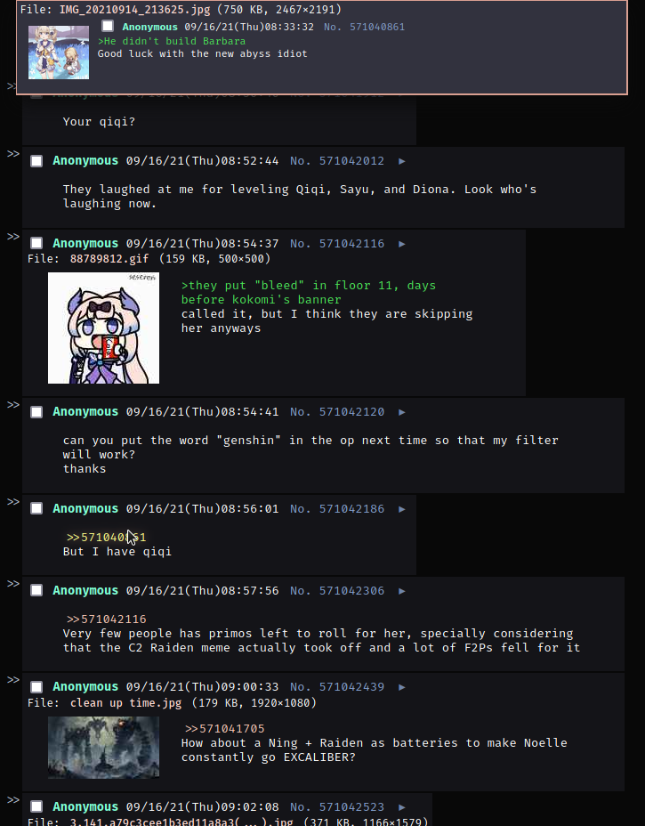
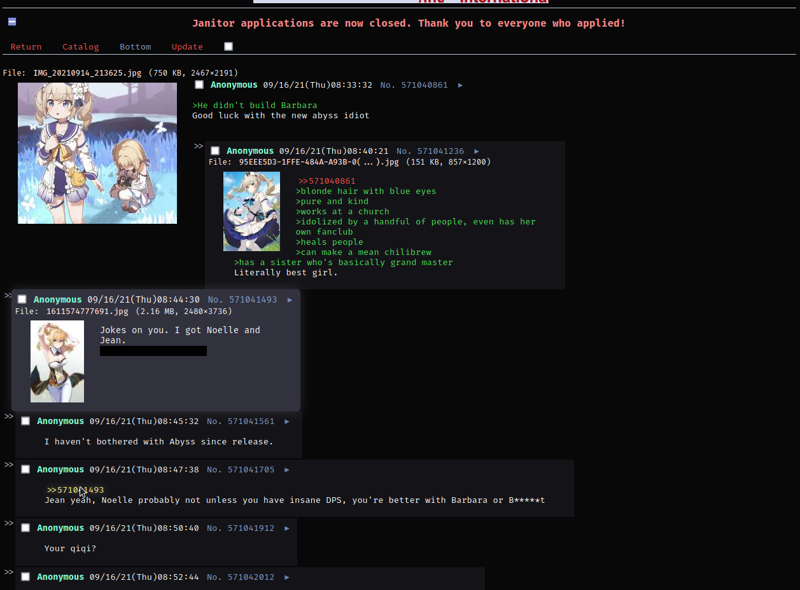
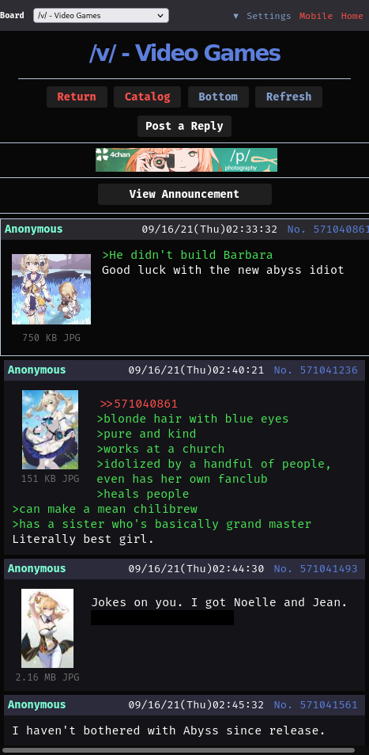
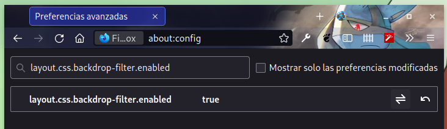

<b style = "font-size: 9px;">Languaje - [es](README_es.md)</b>

# Cold-Night
Dark Theme for the 4chan site

### Compatibility

- [x] 4Chan Vanilla
- [ ] Lainchan
### A little more about this

I'm making this theme to practice and to keep learning CSS.

I want to give it modern styles, with strong colors but without being annoying to the eye, and at the same time preserving the style or essence of the page.

ª and the dark theme for the view.

### How to add these ugly styles to 4chan?

<a href = "add_styles.md">Here</a>
### Another thing

Make sure you have that enabled in **Firefox**, in <a href = "about:config">about:config</a> if you want to use the Blurred variant.

that's right, enter this in Firefox <a href = "about:config">about:config</a>

<pre>
layout.css.backdrop-filter.enabled
</pre>

Translated with www.DeepL.com/Translator (free version)
